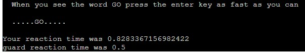

# TakeOver
(Developer: Terry Martin)

[Live webpage](https://takeover-terry-martin.herokuapp.com/)

## Table Of Contents

1. [Project Goals](#project-goals)
    1. [Creator Goals](#creator-goals)
    2. [Player Goals](#player-goals)
2. [Game Info](#game-info)
    1. [Game Story](#game-story)
    2. [Game Basics](#game-basics)
    3. [Flow Chart](#flow-chart)
3. [User Experience](#user-experience)
    1. [Target Audience](#target-audience)
    2. [User Requrements and Expectations](#user-requirements-and-expectations)
    3. [User Stories](#user-stories)
4. [Design](#design)
    1. [Design Choices](#design-choices)
    2. [Colour](#colour)
5. [Technologies Used](#technologies-used)
    1. [Languages](#languages)
    2. [Frameworks and Tools](#frameworks-and-tools)
6. [Features](#features)
7. [Testing](#validation)
    1. [Python Validation](#PYTHON-validation)
    2. [Bugs](#Bugs)
8. [Deployment](#deplyment)
9. [Credits](#credits)
10. [Acknowledgements](#acknowledgements)

## Project Goals

### Creator Goals
- Build a python project
- Create a game about taking over a town
- Allow user to input name and make selections based on story questions
- Give user a chance to complete game under certain conditions
- Display relevant info to user at correct time
- Two main battle types - Auto and Reaction time
- Final battle with change to Reaction time battle

### Player Goals
- Read story and options
- Enter name
- View foe info
- Make selections
- View current health
- Respond to reaction time battles
- Chance to defeat final boss
- Retry game after defeat

## Game Info

### Game story
- You are a born survivor and a seasoned warrior. Weary of seeing the corrupt politians and greedy landowners thrive on the back of your blood and sweat.
- No longer willing to take orders for pitiful payouts
- Its time to put your skills and charisma to the test and seat yourself at the top of the table.
- Determined to crush anyone that dares to stand in your way

### Game Basics
- User will see the intro screen with game name and then read short story intro
- User will then be giving a choice of two options (Decision Branch 1)
- One option will lead to an automatic battle against 3 foes
- The other option will lead to a reaction time battle. In this case, the user will need to press the Enter key when the word GO appears and hope their reaction time is faster than that set for foe
- User will lose health for each hit they take
- If health goes below zero at any stage of game, it will be game over. 
- User will then be giving a choice of two options (Decision Branch 2)
- This will run similar to options in first decision branch
- User will then be giving a choice of two options (Decision Branch 3)
- This will run similar to options in first decision branch except there is no reaction time battle
- User will then face a final battle. 
- This final battle is based on reaction time battle but user will have to count to seven seconds in their head after the trigger word and only then press enter. 
- Game will auto restart after it ends

### Flow Chart

## User Experience

### Target Audience
The website is designed with the following target audience in mind:
- Project assessor
- Student peers
- People with an interest in python
- People who enjoy games
- People with a interest in adventure games
- People fed up with landlords

### User Requirements and Expectations
- Straight forward, easy to use interface
- Time to read and make selections
- Clear target to complete the game
- Retry game

### User Stories

#### Player
1. As a player, I want to start the game
2. As a player, I want to understand what the game is about
3. As a player, I want to be able to enter my name
4. As a player, i want to know how much health I have left
7. As a player, I want to receive acknowledment if i complete the game
8. As a player, I want to be able to play the game without any bugs

#### Creator
13. As the creator, I want showcase my abilities with python
14. As the creator, I want users to enjoy the game and have a interest in completing it
15. As the creator, I want users to be surprised by some of the game features
16. As the creator, I want the game to be bug free and capture/handle any likely user input errors

## Design

### Design Choices
The website was designed to be displayed with a custom/CI made python enviroemt that mimics a website.
pyfiglet and colorama were used to style and format the text

### Colour
Basic colours were chosen from those available through https://pypi.org/project/colorama/

## Technologies Used

### Languages
The following languages were used to develop the website:
- Python

### Frameworks and Tools
The following frameworks and tools were used to develop the website:
- Heroku
- Gitpod
- Google Sheets
- Colorama
- Pyfiglet
- Miro

## Features

### Title

- Made with Colorama and Pyfiglet

### Player Name and Stats

- Allows user enter their name
- Displays current stats

### Player Choices

- Gives users two options
- Both will lead to a battle but one to reaction time and the other to auto

### Auto Battle

- Player will battle three foes one after the other.
- This battle will run automatically with no user input needed
- Player health and attack and foe status will show as it loops through attacks

### Reaction Battle

- User to hit Enter key as soon as trigger word appears on screen
- User will be prompted to prepare for this battle
- There will then be a randon delay (between 2 and 5 seconds) before the trigger word appears on screen and reaction timer begins
- Each foe has a differenct reaction time assigned to them
- Final battle adds a level of difficulty to this by telling the user to wait for 7 seconds AFTER the trigger word appears on screen before hitting ENTER
- Target to win this battle (and clear game) is to press enter between 6.5 to 7.5 seconds after trigger word

### Error Handling

### Game Over

- Made with Colorama and Pyfiglet

## Testing

### CI Python Linter

- Passed through https://pep8ci.herokuapp.com/
- All clear, no errors found

### Bugs

- Bug: When adding pyfiglet and colorama
- Fix: Rearrange order of inport statements at top of run.py

- Bug: In deployed site after adding pyfiglet and colorama
- Fix: Add names and versions to requirements.txt

- Bug: Using Character class out of scope
- Fix: Pass data through arguments in functions

## Deployment
- Code placed in the `run.py` file
- Dependencies placed in the `requirements.txt` file

## Creating the Heroku app

Followed instructions from Code Institute:
- Add two buildpacks from the _Settings_ tab. The ordering is as follows:
- 1. `heroku/python`
- 2. `heroku/nodejs`
- Create a _Config Var_ called `PORT`. Set this to `8000`
- For credentials, create another _Config Var_ called `CREDS` and paste the JSON into the value field.
- Connect  GitHub repository and deploy
- The deployment terminal is set to 80 columns by 24 rows.

- Part 1 - https://learn.codeinstitute.net/courses/course-v1:CodeInstitute+LS101+2021_T1/courseware/293ee9d8ff3542d3b877137ed81b9a5b/e3b664e16366444c8d722c5d8340b340/
- Part 2 - https://learn.codeinstitute.net/courses/course-v1:CodeInstitute+LS101+2021_T1/courseware/293ee9d8ff3542d3b877137ed81b9a5b/e3b664e16366444c8d722c5d8340b340/

### Code

- Validation code based on: https://www.youtube.com/watch?v=LUWyA3m_-r0

## Acknowledgements

Thanks to all the below:
- Classmates who are always on halnd to help out
- Slack community
- Course facilitator (Paul Thomas)
